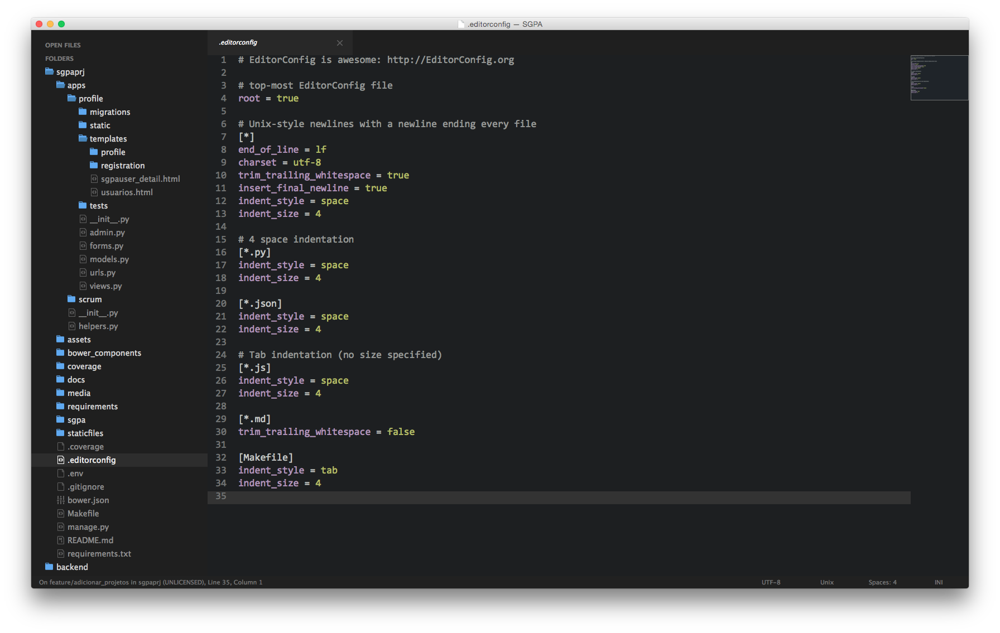

# Postdawn

### A dark interface and syntax theme for [Sublime Text](https://sublime.wbond.net/packages/Postdawn).

## TODO

- [x] Update theme from Predawn to Postdawn
- [x] Prefix the theme settings with postdawn_
- [ ] Update all the screenshots
- [ ] Send to Show Hackernews to receive feedback
- [ ] Profit !

## About

Postdawn is a minimal Sublime Text theme and a syntax color scheme. It was originally just a slightly tweaked version of the [Predawn](https://github.com/paulstraw/predawn) theme. I decided to keep going with customization, so I changed the theme name to Postdawn and lets see how it goes. As the previous themers, I owe a lot to Predawn, Flatland and Soda. Thanks guys, you are amazing !

[View a larger screenshot](https://raw.github.com/douglas/postdawn/master/screenshots/screenshot_new.png)

## Installation for [Sublime Text](https://sublime.wbond.net/packages/Postdawn)

###Recommended
For easy installation, install with [Package Control](https://sublime.wbond.net/docs).

1. <kbd>Cmd</kbd> + <kbd>Shift</kbd> + <kbd>P</kbd> (OS X) <kbd>Ctrl</kbd> + <kbd>Shift</kbd> + <kbd>P</kbd> (Win/Linux)
2. Type `Package Control: Install Package`
3. Search `postdawn`

**Other Methods**

You can clone the repo to your `Packages` folder. Just make sure the repo folder is named `Postdawn`.

Of course, you can always [install manually](https://github.com/douglas/postdawn/archive/master.zip), too.

## Activating the Theme

_Note: This theme uses file icons, so it is only supported for **[DEV BUILDS 3062](http://www.sublimetext.com/3dev)+**._

Open your user settings file `preferences.sublime-settings` as shown below:

To activate the theme, add or replace your current theme settings with the code below.

	{
	  "theme": "postdawn.sublime-theme",
	  "color_scheme": "Packages/Postdawn/postdawn-tomorrow.dark.tmTheme"
	}

*** IMPORTANT - MAKE SURE TO RESTART SUBLIME AFTER INSTALLING AND ACTIVATING POSTDAWN ***

## Tab Height Size Options

You can change the height of the file tabs by adding either to your preferences file:

	"postdawn_tabs_small": true

OR

	"postdawn_tabs_medium": true

## Find & Replace Small Size Option

You can change the height of the Find/Replace inputs by adding the following to preferences file:

	"postdawn_findreplace_small": true

After enabling the smaller size, you'll need to drag the height of the Find/Replace panel up and down to adjust it to the new dimemension.

## Sidebar Size Options

You can change the vertical spacing of the sidebar by changing `default` to `xsmall`, `small`, `medium`, `large`, `xlarge`:

	"postdawn_sidebar_default": true

for example:

	"postdawn_sidebar_large": true

## A few of my favorite options
These are just a few of my other favorite options for Sublime Text:

	// Typography

	"font_face": "Consolas",
	"font_size": 18,
	"highlight_line": true,
	"caret_extra_width": 1,
	"caret_style": "phase",
	"word_wrap": false,

	// Whitespace, Matching, Copy & Auto-Complete

	"translate_tabs_to_spaces": true,
	"trim_trailing_white_space_on_save": true,

	// Interface & Behavior

	"draw_minimap_border": true,
	"enable_tab_scrolling": false,
	"overlay_scroll_bars": "enabled",
	"open_files_in_new_window": false,
	"preview_on_click": false,
	"scroll_past_end": true,

## And some recommendations

Also, I highly recommend these Sublime Text packages:

* [Anaconda](https://github.com/DamnWidget/anaconda)
* [Better CoffeeScript](https://github.com/aponxi/sublime-better-coffeescript)
* [BracketHighlighter](https://github.com/facelessuser/BracketHighlighter)
* [Color Highlighter](https://github.com/Monnoroch/ColorHighlighter)
* [ColorSchemeEditor](https://github.com/bobef/ColorSchemeEditor)
* [DashDoc](https://github.com/farcaller/DashDoc)
* [Djaneiro](https://github.com/squ1b3r/Djaneiro)
* [Dockerfile Syntax Highlighting](https://github.com/asbjornenge/Dockerfile.tmLanguage)
* [EditorConfig](https://github.com/sindresorhus/editorconfig-sublime)
* [Emmet](https://github.com/sergeche/emmet-sublime#readme)
* [GitGutter](https://github.com/jisaacks/GitGutter)  
* [Git​Hub Flavored Markdown Preview](http://dotcypress.github.io/GitHubMarkdownPreview/)
* [Handlebars](https://github.com/daaain/Handlebars)
* [INI](https://github.com/clintberry/sublime-text-2-ini)
* [Jade](https://github.com/davidrios/jade-tmbundle)
* [Jinja2](https://github.com/mitsuhiko/jinja2-tmbundle)
* [jQuery](https://github.com/SublimeText/jQuery)
* [LESS](https://github.com/danro/LESS-sublime)
* [nginx](https://github.com/brandonwamboldt/sublime-nginx)
* [PHP-Twig](https://github.com/Anomareh/PHP-Twig.tmbundle)
* [Pretty JSON](https://github.com/dzhibas/SublimePrettyJson)
* [Project Manager](https://github.com/randy3k/Project-Manager)
* [Puppet](https://github.com/russCloak/SublimePuppet)
* [Sass](https://github.com/nathos/sass-textmate-bundle)
* [SCSS](https://github.com/MarioRicalde/SCSS.tmbundle)
* [SideBarEnhancements](https://github.com/titoBouzout/SideBarEnhancements)
* [Sublime-CSS3](https://github.com/i-akhmadullin/Sublime-CSS3)  
* [SublimeGit](https://sublimegit.net/)
* [SublimeLinter](http://www.sublimelinter.com/en/latest/)
* [SublimeLinter-annotations](https://sublime.wbond.net/packages/SublimeLinter-annotations)
* [SublimeLinter-flake8](https://github.com/SublimeLinter/SublimeLinter-flake8)
* [SublimeLinter-jshint](https://github.com/SublimeLinter/SublimeLinter-jshint)
* [SublimeLinter-json](https://sublime.wbond.net/packages/SublimeLinter-json)
* [SublimeLinter-php](https://github.com/SublimeLinter/SublimeLinter-php)
* [Theme - itg.flat](https://github.com/itsthatguy/theme-itg-flat)
